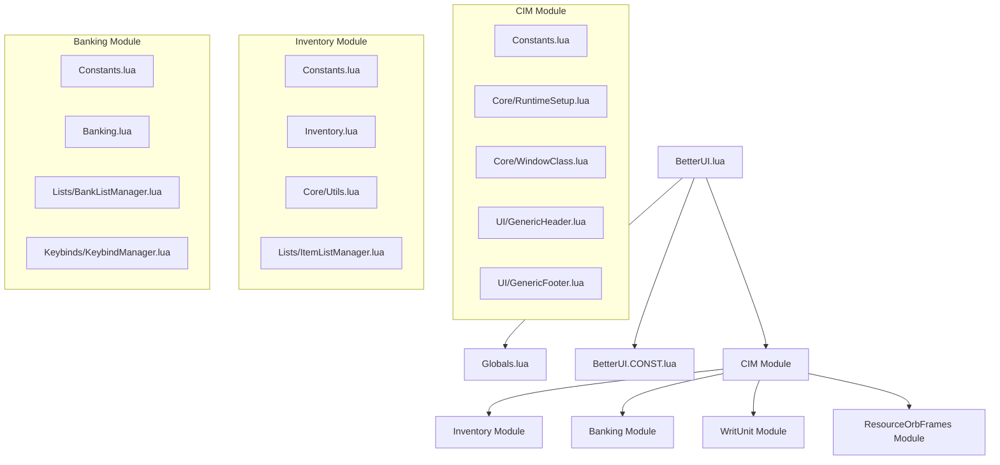
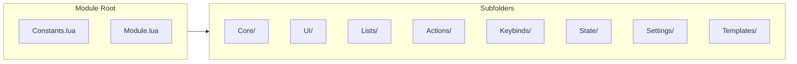
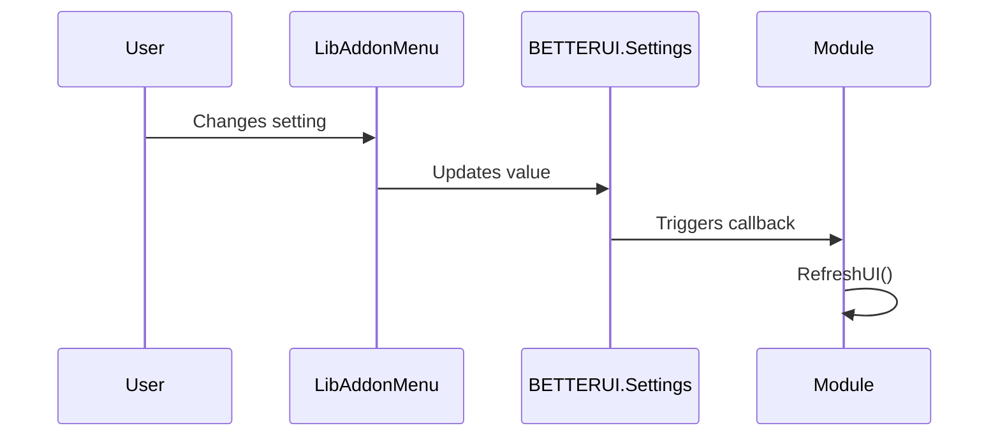

# BetterUI Architecture Overview

> **Audience**: Developers working on the BetterUI codebase.
> **Last Updated**: 2026-01-31

---

## 1. Project Summary

**BetterUI** is an Elder Scrolls Online (ESO) addon that enhances the gamepad interface. It provides improved Inventory, Banking, Tooltip, and Writ tracking experiences through custom UI components and streamlined interactions.

**Key Technologies**:
- **Lua 5.1** (ESO's embedded scripting language)
- **ESO UI Framework** (XML-defined controls, ZO_Object class system)
- **LibAddonMenu2 (LAM)** for settings panels

---

## 2. High-Level Architecture

```
┌─────────────────────────────────────────────────────────────────────────┐
│                           BetterUI Addon                                │
├─────────────────────────────────────────────────────────────────────────┤
│  Entry Point: BetterUI.lua                                              │
│  ├── EVENT_ADD_ON_LOADED → BETTERUI.Initialize()                        │
│  ├── Loads SavedVariables (BetterUISavedVars)                           │
│  └── Calls Module.Setup() for each enabled module                       │
├─────────────────────────────────────────────────────────────────────────┤
│  Core Layer                                                             │
│  ├── Globals.lua          (Namespace init, utility functions)           │
│  ├── BetterUI.CONST.lua   (UI const, currency config, header layouts)   │
│  └── BetterUI_Shared.xml  (Shared XML templates & styles)               │
├─────────────────────────────────────────────────────────────────────────┤
│  Common Interface Module (CIM)  [Modules/CIM/]                          │
│  ├── Constants.lua + Module.lua (Root - minimal entry points)           │
│  ├── Core/       (39 files: RuntimeSetup, FeatureFlags, Utilities, etc.)│
│  ├── UI/         (GenericHeader, GenericFooter)                         │
│  ├── Lists/      (7 files: ItemDataProcessor, ListRefreshManager, etc.) │
│  ├── Tooltips/   (Enhanced item tooltip rendering)                      │
│  ├── Nameplates/ (Font customization)                                   │
│  ├── Actions/    (GenericSlotActions, ActionDialogUtils)                │
│  ├── Keybinds/   (Keybind helpers)                                      │
│  └── Templates/  (Shared XML templates)                                 │
├─────────────────────────────────────────────────────────────────────────┤
│  Feature Modules (all follow Minimal Root pattern)                      │
│  ├── Inventory/       (Enhanced inventory with categories, search)      │
│  ├── Banking/         (Bank/Guild Bank/House Bank interface)            │
│  ├── ResourceOrbFrames/ (Custom Health/Magicka/Stamina Orbs + SkillBar) │
│  └── WritUnit/        (Writ quest tracking panel)                       │
└─────────────────────────────────────────────────────────────────────────┘
```

---

## 3. Minimal Root Module Structure

All feature modules follow the **Minimal Root** organizational pattern. Only essential files remain at the module root:

| Root Files | Purpose |
|------------|---------|
| `Constants.lua` | Module-specific constants and configuration |
| `Module.lua` | Entry point, settings registration, initialization |

All other files are organized into subfolders by responsibility:

| Subfolder | Purpose | Examples |
|-----------|---------|----------|
| `Core/` | Core logic, utilities, integrations | `Utils.lua`, `RuntimeSetup.lua` |
| `UI/` | Visual components, headers, footers | `GenericHeader.lua`, `TooltipUtils.lua` |
| `Lists/` | List management, templates | `ItemListManager.lua`, `BankListManager.lua` |
| `Actions/` | Action discovery, dialogs | `TransferActions.lua`, `ActionDialogHooks.lua` |
| `Keybinds/` | Keybind descriptors and management | `KeybindManager.lua` |
| `State/` | State management, mode tracking | `StateManager.lua` |
| `Settings/` | LAM settings panel definitions | `CurrencySettings.lua` |
| `Search/` | Search functionality | `SearchManager.lua` |
| `Templates/` | XML template files | `*.xml` |
| `Images/` or `Textures/` | Art assets | `*.dds` |

### Module Directory Examples

**CIM Module** (`Modules/CIM/`):
```
CIM/
├── Constants.lua          # CIM-specific constants (TIMING, MODULES, SCREEN)
├── Module.lua             # Entry point
├── Core/                  # 39 files (see Core Reference below)
│   ├── FeatureFlags.lua   # Runtime feature flag system
│   ├── ControlCache.lua   # Cached control references
│   ├── Interfaces.lua     # EmmyLua interface contracts
│   ├── NavigationState.lua# Category/position state tracking
│   ├── PositionManager.lua# List position persistence
│   ├── SearchManager.lua  # Unified search logic
│   ├── RuntimeSetup.lua   # API patches, migrations
│   ├── WindowClass.lua    # Base Window implementation
│   ├── Utilities.lua      # General helpers (SafeIcon, Debug)
│   └── ...                # HookFactory, SettingsFactory, etc.
├── UI/                    # GenericHeader.lua, GenericFooter.lua
├── Lists/                 # 7 files: ItemDataProcessor, ListRefreshManager, etc.
├── Tooltips/              # Tooltip enhancement logic
├── Nameplates/            # Font customization
├── Actions/               # GenericSlotActions.lua, ActionDialogUtils.lua
├── Keybinds/              # Keybind helpers
├── Templates/             # Shared XML templates
└── Images/                # UI assets
```

**Inventory Module** (`Modules/Inventory/`):
```
Inventory/
├── Constants.lua          # Inventory constants
├── Module.lua             # Entry point
├── Inventory.lua          # Main inventory class
├── Loader.lua             # Module initialization
├── Core/                  # Utils.lua, Categories.lua (4 files)
├── UI/                    # TooltipUtils.lua
├── Lists/                 # ItemListManager.lua (5 files)
├── Actions/               # SlotActions.lua, ActionDialogHooks.lua (6 files)
├── Keybinds/              # InventoryKeybinds.lua
├── State/                 # ModeManager.lua (2 files)
├── Settings/              # CurrencySettings.lua, SortSettings.lua (3 files)
└── Templates/             # XML templates
```

**Banking Module** (`Modules/Banking/`):
```
Banking/
├── Constants.lua          # Banking constants (delegates to CIM.CONST.SCREEN)
├── Module.lua             # Entry point
├── Banking.lua            # Main banking class
├── Core/                  # Core utilities
├── UI/                    # HeaderManager.lua, FooterManager.lua (2 files)
├── Lists/                 # BankListManager.lua
├── Actions/               # TransferActions.lua
├── Keybinds/              # KeybindManager.lua
├── State/                 # StateManager.lua
├── Settings/              # CurrencySettings.lua
├── Search/                # SearchManager.lua
└── Images/                # UI assets
```

**ResourceOrbFrames Module** (`Modules/ResourceOrbFrames/`):
```
ResourceOrbFrames/
├── Constants.lua          # Orb/bar constants
├── Module.lua             # Entry point
├── ResourceOrbFrames.lua  # Main orb rendering
├── Core/                  # OrbManagement.lua, etc.
├── SkillBar/              # Coordinator.lua, FrontBarManager.lua, BackBarManager.lua
├── Templates/             # XML templates
└── Textures/              # Orb texture assets
```

---

## 4. File Loading Order

The ESO client loads files in the order specified in `BetterUI.txt`. **Order matters** for dependency resolution.

| Load Phase | Files | Purpose |
|------------|-------|---------|\
| 1. Globals | `Globals.lua` | Initialize `BETTERUI` namespace |
| 2. Localization | `lang/en.lua`, `lang/$(language).lua` | String tables |
| 3. Constants | `BetterUI.CONST.lua` | UI dimensions, currency config |
| 4. Shared XML | `BetterUI_Shared.xml` | Base templates |
| 5. CIM Module | `Modules/CIM/Constants.lua` → `Core/*` → `UI/*` → ... | Shared UI (starts with RuntimeSetup) |
| 6. Feature Modules | Inventory, Banking, ResourceOrbFrames, WritUnit | Dependent on CIM |
| 7. Entry Point | `BetterUI.lua` | `EVENT_ADD_ON_LOADED` handler |

> **Critical**: CIM must load before Inventory/Banking because they inherit from CIM templates.

---

## 5. Namespace Structure

All addon code lives under the global `BETTERUI` table, defined in `Globals.lua`.

```lua
BETTERUI = {
    -- Metadata
    name = "BetterUI",
    version = "2.93",

    -- ESO API Caches
    WindowManager = GetWindowManager(),
    EventManager = GetEventManager(),

    -- Core Subsystems
    CONST = {},              -- Constants (BetterUI.CONST.lua)
    CIM = {                  -- Common Interface Module
        CONST = {},          -- CIM-specific constants
    },
    Interface = {            -- Base UI utilities
        Window = {},         -- Window class (Core/WindowClass.lua)
    },
    GenericHeader = {},      -- Header management (UI/GenericHeader.lua)
    GenericFooter = {},      -- Footer/currency display (UI/GenericFooter.lua)
    ControlUtils = {},       -- Control utilities (Core/ControlUtils.lua)

    -- Feature Modules
    Inventory = {
        Class = {},          -- Main inventory logic
        List = {},           -- List rendering
        Utils = {},          -- Utilities (Core/Utils.lua)
        Categories = {},     -- Category logic (Core/Categories.lua)
    },
    Banking = {
        Class = {},          -- Banking logic
        LIST_WITHDRAW = 1,   -- Mode constant
        LIST_DEPOSIT = 2,    -- Mode constant
    },
    Tooltips = {},           -- Tooltip enhancements
    Nameplates = {},         -- Nameplate customization
    Writs = {
        List = {},           -- Writ tracking
    },
    ROF = {},                -- ResourceOrbFrames

    -- Settings
    Settings = {},           -- Runtime settings (loaded from SavedVariables)
    DefaultSettings = {},    -- Default values template
    SavedVars = {},          -- Raw SavedVariables reference
}
```

---

## 6. Module Quick Reference

| Module | Root Files | Key Subfolders | Dependencies | Purpose |
|--------|------------|----------------|--------------|---------|
| **CIM** | Constants, Module | Core (39), UI (10), Lists (10), Tooltips, Actions | None | Shared UI, runtime patches, tooltips, feature flags |
| **Inventory** | Constants, Module, Inventory, Loader | Core, UI, Lists, Actions (6), State, Settings | CIM | Enhanced inventory with categories |
| **Banking** | Constants, Module, Banking | Core, UI, Lists, Actions, State, Settings, Search | CIM | Bank/House Bank interface |
| **ResourceOrbFrames** | Constants, Module, ResourceOrbFrames | Core, SkillBar, Settings, Templates, Textures | CIM | Custom resource orbs + skill bar |
| **WritUnit** | Constants, Module | Core, Templates | CIM | Writ quest tracker |

---

## 7. Common Code Patterns

### 7.1 ZO_Object Subclassing
ESO uses a prototype-based OOP system via `ZO_Object`.

```lua
-- Define a new class
BETTERUI.MyClass = ZO_Object:Subclass()

-- Constructor (factory method)
function BETTERUI.MyClass:New(...)
    local obj = ZO_Object.New(self)
    obj:Initialize(...)
    return obj
end

-- Initialization logic
function BETTERUI.MyClass:Initialize(param1)
    self.data = param1
end
```

### 7.2 Module Setup Pattern
Each module has a `Setup()` function called by `BetterUI.lua`:

```lua
function BETTERUI.MyModule.Setup()
    -- 1. Register settings panel
    Init("ModuleId", "Module Display Name")
    -- 2. Initialize runtime state
    BETTERUI.MyModule.Init()
end
```

### 7.3 Scene Fragment Pattern
UI visibility is controlled via Scene Fragments:

```lua
-- Create a fragment for a control
self.fragment = ZO_SimpleSceneFragment:New(self.control)
-- Add to a scene
SCENE_MANAGER:GetScene("sceneName"):AddFragment(self.fragment)
```

### 7.4 Parametric Scroll List Pattern
Gamepad lists use `ZO_ParametricScrollList`:

```lua
self.list = BETTERUI.Interface.ParametricScrollList:New(control)
self.list:AddDataTemplate("TemplateName", SetupFunction, HeaderSetup)
self.list:AddEntry("TemplateName", entryData)
self.list:Commit()
```

### 7.5 Settings Accessor Pattern
Modules use `BETTERUI.CreateSettingAccessors` to generate `getFunc`/`setFunc` pairs for LAM:

```lua
local GetSet = BETTERUI.CreateSettingAccessors("ModuleName", ApplyCallback)
local getScale, setScale = GetSet("scale", 1.0)

local options = {
    {
        type = "slider",
        getFunc = getScale,
        setFunc = setScale,
    }
}
```

### 7.6 Keybind Strip Management Pattern
Keybind groups must be properly managed to avoid duplication:

```lua
-- Always remove before adding to prevent duplication
KEYBIND_STRIP:RemoveKeybindButtonGroup(self.myKeybinds)
KEYBIND_STRIP:AddKeybindButtonGroup(self.myKeybinds)
KEYBIND_STRIP:UpdateKeybindButtonGroup(self.myKeybinds)
```

### 7.7 Coordinator Pattern (Sub-module Orchestration)
Complex sub-systems use a Coordinator that delegates to specialized managers:

```lua
-- SkillBar/Coordinator.lua orchestrates:
-- - FrontBarManager.lua (front bar logic)
-- - BackBarManager.lua (back bar logic)
-- - TooltipManager.lua (skill tooltips)
-- - UltimateManager.lua (ultimate tracking)
```

### 7.8 SceneLifecycleManager Pattern
Provides unified scene lifecycle management for all modules:

```lua
-- Core/SceneLifecycleManager.lua usage:
BETTERUI.CIM.SceneLifecycle.Register(screen, {
    keybinds = { self.myKeybindGroup },
    taskManager = BETTERUI.CIM.Tasks,
    eventRegistryModule = "MyModule",
    onShowing = function(screen, wasPushed) --[[ setup ]] end,
    onHiding = function(screen) --[[ teardown ]] end,
    onHidden = function(screen) --[[ final cleanup ]] end,
})

-- For fragment-based modules (e.g., ResourceOrbFrames):
BETTERUI.CIM.SceneLifecycle.RegisterFragment(fragment, {
    onShow = function() --[[ show logic ]] end,
    onHide = function() --[[ hide logic ]] end,
})
```

---

## 8. Feature Flags System

BetterUI includes a centralized **Feature Flag System** (`Modules/CIM/Core/FeatureFlags.lua`) for safer feature rollouts and runtime configuration.

### Core API

| Method | Purpose |
|--------|---------|
| `IsEnabled(flagName)` | Check if a feature is enabled (overrides → saved → defaults) |
| `SetEnabled(flagName, enabled)` | Persistently update a flag (saved to `BetterUISavedVars`) |
| `SetOverride(flagName, enabled)` | Temporary runtime override (lost on `/reloadui`) |

### Defined Flags

| Flag | Default | Purpose |
|------|---------|---------|
| `ENHANCED_TOOLTIPS` | `true` | Enhanced display with trait/research info |
| `POSITION_PERSISTENCE` | `true` | Maintain scroll position in lists |
| `BATCH_PROCESSING` | `true` | Use chunked list loading for performance |
| `DEBUG_LOGGING` | `false` | Verbose development logging |
| `PERFORMANCE_METRICS` | `false` | Real-time performance tracking (dev only) |

### Usage Example

```lua
local BATCH_FLAG = BETTERUI.CIM.FeatureFlags.FLAGS.BATCH_PROCESSING

if BETTERUI.CIM.FeatureFlags.IsEnabled(BATCH_FLAG) then
    ProcessBatch(data)
else
    self:LoadAllAtOnce(data)
end
```

---

## 9. External Dependencies

| Dependency | Required | Purpose | Reference |
|------------|----------|---------|-----------|
| **LibAddonMenu-2.0** | Yes | Settings panels | [ESOUI](https://www.esoui.com/downloads/info7-LibAddonMenu.html) |
| **LibDebugLogger** | Optional | Advanced logging | [ESOUI](https://www.esoui.com/downloads/info2275-LibDebugLogger.html) |
| **AutoCategory** | Optional | Custom category integration | External addon |
| **MasterMerchant** | Optional | Price data in tooltips | External addon |
| **TamrielTradeCentre** | Optional | Price data in tooltips | External addon |
| **ArkadiusTradeTools** | Optional | Price data in tooltips | External addon |

---

## 10. Glossary of Terms

| Term | Definition |
|------|------------|
| **CIM** | Common Interface Module — shared UI components |
| **Minimal Root** | Module structure pattern: only Constants.lua + Module.lua at root |
| **Coordinator** | Orchestrating file that delegates to specialized managers |
| **LAM** | LibAddonMenu2 — settings framework |
| **Parametric List** | ZOS's gamepad scrolling list with focus tracking |
| **Tab Bar / Carousel** | LB/RB-navigable header for category switching |
| **Scene** | ESO's visibility state system (e.g., `gamepad_inventory_root`) |
| **Fragment** | A UI element tied to a Scene's visibility |
| **SavedVariables** | Persistent player settings (stored in `BetterUISavedVars`) |
| **SlotType** | ESO constant identifying item context (e.g., `SLOT_TYPE_BANK_ITEM`) |
| **Keybind Strip** | Bottom bar showing controller button mappings |

---

## 11. Data Flow Example: Opening Inventory

```
1. Player presses Menu button
2. SCENE_MANAGER activates "gamepad_inventory_root" scene
3. BETTERUI.Inventory.Class detects scene state change (via callback)
4. :RefreshList() is called:
   a. Queries SHARED_INVENTORY for bag slots
   b. Applies category filters (custom/AutoCategory)
   c. Sorts items
   d. Populates ZO_ParametricScrollList
5. GenericHeader updates with current category tabs
6. GenericFooter refreshes currency values
7. Keybind strip updates with available actions
```

---

## 12. Data Flow Example: Banking Keybind Transitions

```
1. Player opens bank → Banking scene shows
2. Initial keybinds: coreKeybinds + withdrawDepositKeybinds (or currencyKeybinds)
3. Player scrolls to item row:
   a. OnItemSelectedChange() fires
   b. Remove currencyKeybinds, add withdrawDepositKeybinds
   c. Update coreKeybinds (shows Y action button)
   d. Show item tooltip
4. Player scrolls to currency row:
   a. OnItemSelectedChange() fires
   b. Remove withdrawDepositKeybinds, add currencyKeybinds
   c. Update coreKeybinds (hides Y action button)
   d. Show currency tooltip, cleanup enhanced tooltip elements
```

---

## 13. Key Files Reference

| File | Location | Purpose |
|------|----------|---------|
| `BetterUI.lua` | Root | Entry point, module loading |
| `Globals.lua` | Root | Namespace, utilities |
| `BetterUI.CONST.lua` | Root | Constants, currency config |
| `RuntimeSetup.lua` | CIM/Core/ | API patches, migrations, initialization |
| `FeatureFlags.lua` | CIM/Core/ | Runtime feature flag system |
| `SettingsAccessor.lua` | CIM/Core/ | Settings get/set factory |
| `WindowClass.lua` | CIM/Core/ | Base Window class implementation |
| `GenericSlotActions.lua` | CIM/Actions/ | Shared item slot action utilities |
| `GenericHeader.lua` | CIM/UI/ | Tab bar header with LB/RB navigation |
| `GenericFooter.lua` | CIM/UI/ | Currency display footer |
| `Coordinator.lua` | ResourceOrbFrames/SkillBar/ | Skill bar orchestration |
| `TooltipUtils.lua` | Inventory/UI/ | Enhanced tooltip rendering |
| `BankListManager.lua` | Banking/Lists/ | Banking list and keybind management |

---

## 14. Diagrams

### Module Dependency Graph



### Minimal Root Module Structure



### Settings Flow



---

## 15. Development Guidelines

### Adding a New Module

1. Create module folder under `Modules/`
2. Add `Constants.lua` for module-specific constants
3. Add `Module.lua` with `Setup()` function
4. Organize code into subfolders: `Core/`, `UI/`, `Lists/`, etc.
5. Update `BetterUI.txt` manifest with load order
6. Register module in `BetterUI.lua`

### Modifying Keybinds

1. Always call `RemoveKeybindButtonGroup()` before `AddKeybindButtonGroup()`
2. Call `UpdateKeybindButtonGroup()` to refresh visibility of buttons with `visible` functions
3. Define keybind groups in dedicated `Keybinds/` subfolder

### Tooltip Enhancements

1. Use `BETTERUI.Inventory.CleanupEnhancedTooltip()` when switching away from enhanced views
2. Custom elements (status labels, dividers) should be explicitly hidden during cleanup
3. Anchor adjustments should be reset when tooltip is cleared
